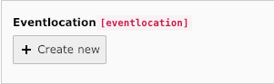

.. include:: ../Includes.txt

=================
Extbase
=================

**Here you can find my hints an code examples for extension-development in extbase**

Relations between tables
----------------------

**There are several methods to realize relations between tables. Here I give an overview after my experiences**

1:1-relation
~~~~~~~~~~~~~~~~~~~

My extension (events) got the possibility to create child-objects (eventlocations) in the backend. So I added/extended these files in my extension-folder:

- exttables.sql
- Classes/Domain/Model/Event.php
- Classes/Domain/Model/Eventlocation.php
- Configuration/TCA/tx_events_domain_model_event.php
- Configuration/TCA/tx_events_domain_model_eventlocation.php
- Resources/Private/Language/locallang_db.xlf
- Resources/Public/Icons/tx_events_domain_model_eventlocation.gif

exttables.sql
===================
Here added the table-structure. Using 9.5 LTS I dont need to configure system-fields like uid, hodde, startdate etc. or PROMARY KEY.

.. code-block:: php

    #
    # Table structure for table 'tx_events_domain_model_eventlocation'
    #
    CREATE TABLE tx_events_domain_model_eventlocation (
        title varchar(255) DEFAULT '' NOT NULL,
    );

    #
    # Table structure for table 'tx_events_domain_model_event'
    #
    CREATE TABLE tx_events_domain_model_event (
        title varchar(255) DEFAULT '' NOT NULL,
        subheadline varchar(255) DEFAULT '' NOT NULL,
        teaser text,
        description text,
        images int(11) DEFAULT '0' NOT NULL,
        files int(11) DEFAULT '0' NOT NULL,
        link varchar(255) DEFAULT '' NOT NULL,
        startdate int(11) unsigned DEFAULT '0' NOT NULL,
        enddate int(11) unsigned DEFAULT '0' NOT NULL,
        eventtype int(11) DEFAULT '0' NOT NULL,
        eventlocation int(11) DEFAULT '0' NOT NULL,
    );

event.php (parent model)
===================

Here I need to add the field and the getter-/setter.methods for the connection to the child

.. code-block:: php

    /**
     * eventlocation
     *
     * @var \TYPO3\CMS\Extbase\Persistence\ObjectStorage<\SvenWiener\Events\Domain\Model\Eventlocation>
     * @cascade remove
     * @lazy
     */
    protected $eventlocation = '';

    /**
     * Get Eventlocation
     *
     * @return \TYPO3\CMS\Extbase\Persistence\ObjectStorage
     */
    public function getEventlocation()
    {
        return $this->eventlocation;
    }

    /**
     * Set Eventlocation
     *
     * @param \TYPO3\CMS\Extbase\Persistence\ObjectStorage $eventlocation
     * @return void
     */
    public function setEventlocation($eventlocation)
    {
        $this->eventlocation = $eventlocation;
    }

eventlocation.php (child model)
===================

Here I need the whole configuration für the object with fileds, getter and setters.

.. code-block:: php

    <?php
    namespace SvenWiener\Events\Domain\Model;

    /***
     *
     * This file is part of the "Events" Extension for TYPO3 CMS.
     *
     * For the full copyright and license information, please read the
     * LICENSE.txt file that was distributed with this source code.
     *
     *  (c) Sven Wiener, 2019
     *
     ***/

    /**
     * Eventlocation
     */
    class Eventlocation extends \TYPO3\CMS\Extbase\DomainObject\AbstractEntity
    {

        /**
         * title
         *
         * @var string
         */
        protected $title = '';

        /**
         * Get Uid
         *
         * @return int
         */
        public function getUid()
        {
            return $this->uid;
        }

        /**
         * Set Uid
         *
         * @param int $uid
         * @return void
         */
        public function setUid($uid)
        {
            $this->uid = $uid;
        }

        /**
         * Get Pid
         *
         * @return int
         */
        public function getPid()
        {
            return $this->pid;
        }

        /**
         * Set Pid
         *
         * @param int $pid
         * @return void
         */
        public function setPid($pid)
        {
            $this->pid = $pid;
        }

        /**
         * Get Title
         *
         * @return string
         */
        public function getTitle()
        {
            return $this->title;
        }

        /**
         * Set Title
         *
         * @param string $title
         * @return void
         */
        public function setTitle($title)
        {
            $this->title = $title;
        }
    }

tx_events_domain_model_event.php
===================

Here I add the TCA-configuration at the parent object

.. code-block:: php

    'eventlocation' => [
        'exclude' => false,
        'label' => 'LLL:EXT:events/Resources/Private/Language/locallang_db.xlf:tx_events_domain_model_event.eventlocation',
        'config' => [
            'type' => 'inline',
            'foreign_table' => 'tx_events_domain_model_eventlocation',
            'foreign_field' => 'event',
            'maxitems' => 9999,
            'appearance' => [
                'collapseAll' => 0,
                'levelLinksPosition' => 'top',
                'showSynchronizationLink' => 1,
                'showPossibleLocalizationRecords' => 1,
                'showAllLocalizationLink' => 1
            ],
        ],
    ],

As you can see, it is needed to configure the foreign_table in events. This configuration makes it possible to add a 1:1-relation. so we don't have any mm-table. We only have the events-table and the eventlocation-table. So one Location belongs to 1 event.

tx_events_domain_model_eventlocation.php
===================

Afterwards we need the whole TCA-configuration for the child-object (eventlocation).

.. code-block:: php

    <?php
    return [
        'ctrl' => [
            'title' => 'LLL:EXT:events/Resources/Private/Language/locallang_db.xlf:tx_events_domain_model_eventlocation',
            'label' => 'title',
            'tstamp' => 'tstamp',
            'crdate' => 'crdate',
            'cruser_id' => 'cruser_id',
            'versioningWS' => true,
            'languageField' => 'sys_language_uid',
            'transOrigPointerField' => 'l10n_parent',
            'transOrigDiffSourceField' => 'l10n_diffsource',
            'delete' => 'deleted',
            'enablecolumns' => [
                'disabled' => 'hidden',
                'starttime' => 'starttime',
                'endtime' => 'endtime',
            ],
            'searchFields' => 'title',
            'iconfile' => 'EXT:events/Resources/Public/Icons/tx_events_domain_model_eventlocation.gif'
        ],
        'interface' => [
            'showRecordFieldList' => 'sys_language_uid, l10n_parent, l10n_diffsource, hidden, title',
        ],
        'types' => [
            '1' => ['showitem' => 'sys_language_uid, l10n_parent, l10n_diffsource, hidden, title, --div--;LLL:EXT:frontend/Resources/Private/Language/locallang_ttc.xlf:tabs.access, starttime, endtime'],
        ],
        'columns' => [
            'sys_language_uid' => [
                'exclude' => true,
                'label' => 'LLL:EXT:core/Resources/Private/Language/locallang_general.xlf:LGL.language',
                'config' => [
                    'type' => 'select',
                    'renderType' => 'selectSingle',
                    'special' => 'languages',
                    'items' => [
                        [
                            'LLL:EXT:core/Resources/Private/Language/locallang_general.xlf:LGL.allLanguages',
                            -1,
                            'flags-multiple'
                        ]
                    ],
                    'default' => 0,
                ],
            ],
            'l10n_parent' => [
                'displayCond' => 'FIELD:sys_language_uid:>:0',
                'exclude' => true,
                'label' => 'LLL:EXT:core/Resources/Private/Language/locallang_general.xlf:LGL.l18n_parent',
                'config' => [
                    'type' => 'select',
                    'renderType' => 'selectSingle',
                    'default' => 0,
                    'items' => [
                        ['', 0],
                    ],
                    'foreign_table' => 'tx_events_domain_model_eventlocation',
                    'foreign_table_where' => 'AND {#tx_events_domain_model_eventlocation}.{#pid}=###CURRENT_PID### AND {#tx_events_domain_model_eventlocation}.{#sys_language_uid} IN (-1,0)',
                ],
            ],
            'l10n_diffsource' => [
                'config' => [
                    'type' => 'passthrough',
                ],
            ],
            't3ver_label' => [
                'label' => 'LLL:EXT:core/Resources/Private/Language/locallang_general.xlf:LGL.versionLabel',
                'config' => [
                    'type' => 'input',
                    'size' => 30,
                    'max' => 255,
                ],
            ],
            'hidden' => [
                'exclude' => true,
                'label' => 'LLL:EXT:core/Resources/Private/Language/locallang_general.xlf:LGL.visible',
                'config' => [
                    'type' => 'check',
                    'renderType' => 'checkboxToggle',
                    'items' => [
                        [
                            0 => '',
                            1 => '',
                            'invertStateDisplay' => true
                        ]
                    ],
                ],
            ],
            'starttime' => [
                'exclude' => true,
                'label' => 'LLL:EXT:frontend/Resources/Private/Language/locallang_ttc.xlf:LGL.starttime',
                'config' => [
                    'type' => 'input',
                    'renderType' => 'inputDateTime',
                    'size' => 16,
                    'eval' => 'datetime,int',
                    'default' => 0,
                    'behaviour' => [
                        'allowLanguageSynchronization' => true,
                    ],
                ]
            ],
            'endtime' => [
                'exclude' => true,
                'label' => 'LLL:EXT:core/Resources/Private/Language/locallang_general.xlf:LGL.endtime',
                'config' => [
                    'type' => 'input',
                    'renderType' => 'inputDateTime',
                    'eval' => 'datetime,int',
                    'default' => 0,
                    'range' => [
                        'upper' => mktime(0, 0, 0, 1, 1, 2038)
                    ],
                    'behaviour' => [
                        'allowLanguageSynchronization' => true
                    ]
                ],
            ],
            'title' => [
                'exclude' => true,
                'label' => 'LLL:EXT:events/Resources/Private/Language/locallang_db.xlf:tx_events_domain_model_event.title',
                'config' => [
                    'type' => 'input',
                    'size' => 30,
                    'eval' => 'trim'
                ],
            ],
            'event' => [
                'config' =>[
                    'type' => 'passthrough',
                ],
            ],
        ],
    ];

Here you can see that we need the connection to the parent object via the passthrough declaration.

locallang_db.xlf and gif
===================

Of course we need thr language-file for the labels and the gif to have a nice icon.

Output
===================

After all these configuration we got the possibility to add childobjects direct in the create/edit-form of the parent object (event)

