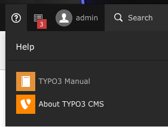

.. include:: ../Includes.txt

=================
System Extensions
=================

**Overview and introduction of the TYPO3 system-extentions**

Required system-extensions
---------------------------------

These required extensions are part of the minimal-installation-package.

backend
~~~~~~~~~~~~~~~~~~~
core
~~~~~~~~~~~~~~~~~~~
extbase
~~~~~~~~~~~~~~~~~~~
extensionmanager
~~~~~~~~~~~~~~~~~~~
felogin
~~~~~~~~~~~~~~~~~~~
filelist
~~~~~~~~~~~~~~~~~~~
fluid
~~~~~~~~~~~~~~~~~~~
form
~~~~~~~~~~~~~~~~~~~
frontend
~~~~~~~~~~~~~~~~~~~
impexp
~~~~~~~~~~~~~~~~~~~
indexed_search
~~~~~~~~~~~~~~~~~~~
install
~~~~~~~~~~~~~~~~~~~
recordlist
~~~~~~~~~~~~~~~~~~~
rte_ckeditor
~~~~~~~~~~~~~~~~~~~

Optional system-extensions
----------------------
**General Info**

It is absolutely recommended to use the typo3-console-Extension by Helmut Hummel in Composermode-Installations.

**Install the Extension:**

.. code-block:: php

   composer require helhum/typo3-console
After that you can use the console to install and activate new extensions.

**Here an example:**

.. code-block:: php

   composer require typo3/cms-info
   vendor/bin/typo3cms extension:setupactive info
   vendor/bin/typo3cms install:generatepackagestates

about
~~~~~~~~~~~~~~~~~~~
Shows info about TYPO3, installed extensions and a separate module for available modules.

adminpanel
~~~~~~~~~~~~~~~~~~~
The TYPO3 admin panel provides a panel with additional functionality in the frontend (Debugging, Caching, Preview...

belog
~~~~~~~~~~~~~~~~~~~
Displays backend log, both per page and system wide. Available as the module Tools>Log (system wide overview) and Web>Info/Log (page relative overview).

beuser
~~~~~~~~~~~~~~~~~~~
Backend user administration and overview. Allows you to compare the settings of users and verify their permissions and see who is online.

fluid_styled_content
~~~~~~~~~~~~~~~~~~~
A set of common content elements based on Fluid for Frontend output.

info
~~~~~~~~~~~~~~~~~~~
Shows various infos

redirects
~~~~~~~~~~~~~~~~~~~
Manage redirects for your TYPO3-based website.

reports
~~~~~~~~~~~~~~~~~~~
The reports module groups several system reports.

scheduler
~~~~~~~~~~~~~~~~~~~
The TYPO3 Scheduler let's you register tasks to happen at a specific time

seo
~~~~~~~~~~~~~~~~~~~
Add basic SEO features to TYPO3

setup
~~~~~~~~~~~~~~~~~~~
Allows users to edit a limited set of options for their user profile, eg. preferred language and their name and email address.

sys_note
~~~~~~~~~~~~~~~~~~~
Records with messages which can be placed on any page and contain instructions or other information related to a page or section.

t3editor
~~~~~~~~~~~~~~~~~~~
JavaScript-driven editor with syntax highlighting and codecompletion. Based on CodeMirror.

tstemplate
~~~~~~~~~~~~~~~~~~~
Framework for management of TypoScript template records for the CMS frontend.
composer require typo3/cms-tstemplate

viewpage
~~~~~~~~~~~~~~~~~~~
Shows the frontend webpage inside the backend frameset.

